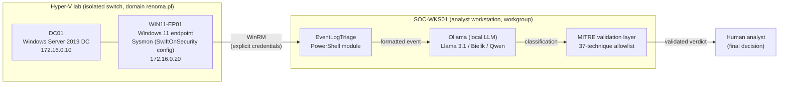

# EventLogTriage

PowerShell toolkit for AI-assisted triage of Windows Sysmon events: collect endpoint telemetry, classify it with a local LLM, and validate every MITRE ATT&CK claim against an allowlist, because local models hallucinate technique IDs.

Built and tested on a self-hosted Active Directory lab (Hyper-V, Windows Server 2019 DC + Windows 11 endpoint).

## Why this exists

SOC L1 analysts burn most of their time on repetitive event triage. Local LLMs (8B-14B) are fast and private enough to help, but they cannot be trusted blindly. During model evaluation on real Sysmon events I observed two distinct failure modes:

| Model | Failure mode | Example |
|---|---|---|
| Llama 3.1 8B | **Fabricates** MITRE technique IDs | Returned non-existent `T1160` |
| Bielik 11B v2.3 | **Misapplies** real IDs | Returned valid IDs (`T1059`, `T1105`) assigned to the wrong behaviour |

That observation drives the core design: every MITRE ID the model emits is validated against a curated allowlist ([Data/valid-mitre-techniques.json](Data/valid-mitre-techniques.json), 37 techniques, ATT&CK v16), and the model is constrained to choose from that list rather than generate freely.

## Architecture



Pipeline: Sysmon → PowerShell collection → local LLM classification → MITRE validation → human-in-the-loop.

## Status

Phase 1 (data collection layer) is complete.

| Component | Status |
|---|---|
| `Get-RecentSysmonEvents`: local + remote (WinRM) Sysmon collection, normalised output | ✅ Done |
| `Test-WinRMConnection`: tri-state WinRM diagnostic (`Healthy` / `Inconclusive` / `Failed`) | ✅ Done |
| MITRE ATT&CK allowlist (37 techniques, machine-readable verification status) | ✅ Done |
| Pester v5 test suites (mocked `Get-WinEvent`, `Invoke-Command`, `Test-WSMan`) | ✅ Done |
| `Invoke-EventClassification`: LLM call with constrained-choice prompt + allowlist validation | 🔨 In progress |
| `Format-EventForLLM`: event-to-prompt conversion | 🔨 In progress |
| End-to-end pipeline (`Invoke-EventTriage`) | 📋 Planned |

Known low-priority items are tracked in [FUTURE_WORK.md](FUTURE_WORK.md).

## Usage

```powershell
Import-Module .\EventLogTriage.psd1

# Last hour of key Sysmon events from the local machine
Get-RecentSysmonEvents -Verbose

# Remote collection from the domain endpoint (workgroup -> domain requires explicit credentials)
$cred = Get-Credential renoma\Administrator
Get-RecentSysmonEvents -ComputerName WIN11-EP01 -Credential $cred -HoursBack 4 -MaxEvents 200

# WinRM not working? Diagnose it. Returns a concrete remediation command.
Test-WinRMConnection -ComputerName WIN11-EP01 -Credential $cred
```

Default collection covers Sysmon event IDs `1, 3, 7, 10, 11, 22` (ProcessCreate, NetworkConnect, ImageLoad, ProcessAccess, FileCreate, DnsQuery). These are the events with the highest detection value per SwiftOnSecurity's config philosophy.

## Key design decisions

1. **Allowlist validation for MITRE IDs.** Existence check catches fabricated IDs; the canonical technique name stored alongside each ID enables sanity-checking the model's reasoning against what the technique actually means. Never trust the model's MITRE field.
2. **Constrained choice over free generation.** The system prompt gives the model the fixed list of valid technique IDs; it selects, it doesn't invent.
3. **Local LLMs over cloud APIs.** Event logs contain hostnames, usernames and file paths. That data should not leave the SOC. Ollama keeps everything on-prem and works offline.
4. **Tri-state WinRM diagnostics.** An anonymous WSMan `Identify` succeeding does *not* prove authenticated remoting will work. `Test-WinRMConnection` refuses to report `Healthy` unless the real credentialed handshake was exercised. A false green is exactly the class of bug a diagnostic must not have.
5. **Read-only by default, human-in-the-loop for actions.** The tooling collects and classifies; a human approves anything that changes state.

## Testing

```powershell
Invoke-Pester -Path .\Tests
```

All external boundaries (`Get-WinEvent`, `Invoke-Command`, `Test-WSMan`, `Test-NetConnection`) are mocked, so the suite runs on any machine without the lab.

## Lab

| Host | Role |
|---|---|
| SOC-WKS01 | Analyst workstation (workgroup); i5-12400F, RTX 3060 12GB, 32GB RAM |
| DC01 | Windows Server 2019, domain controller for `renoma.pl` |
| WIN11-EP01 | Windows 11 endpoint, domain-joined, Sysmon with SwiftOnSecurity config |

The workgroup-to-domain split is deliberate: it forces the explicit-credential and TrustedHosts handling a real cross-boundary SOC deployment would need.

## Possible extensions

Wazuh SIEM integration, multi-model voting, MCP server interface. Out of scope for the current phase.
