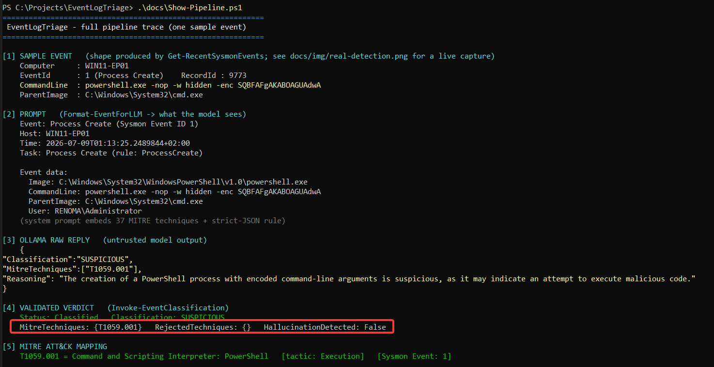
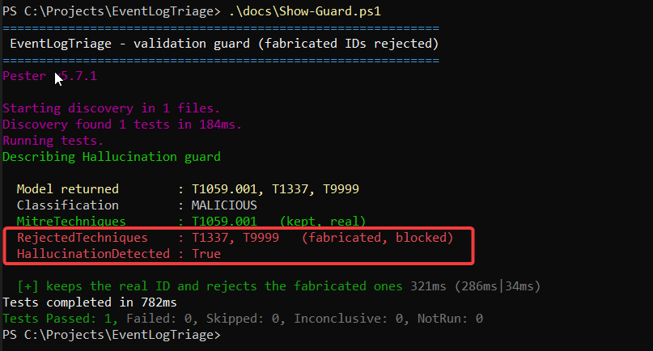

# Pipeline walkthrough: from event to verdict

This traces one real Sysmon event through the whole pipeline, from collection to a validated MITRE ATT&CK verdict. Every output below is real, captured against the live lab (endpoint `WIN11-EP01`, analyst workstation `SOC-WKS01`, local Ollama with `llama3.1:8b-instruct-q4_K_M`).

The example event is a hidden, base64-encoded PowerShell process launched from `cmd.exe`, a common pattern malware uses to stay out of sight.

The whole trace at a glance, produced by `Show-Pipeline.ps1`. The sections below break down each stage.



## Stage 1: the collected event

`Get-RecentSysmonEvents` pulls the Sysmon event from the endpoint over WinRM and normalises it. The `RecordId` is preserved so an analyst can pivot back to the exact source record after classification.

```
Computer    : WIN11-EP01
EventId     : 1  (Process Create)
RecordId    : 9773
CommandLine : powershell.exe -nop -w hidden -enc SQBFAFgAKABOAGUAdwA
ParentImage : C:\Windows\System32\cmd.exe
User        : RENOMA\Administrator
```

## Stage 2: the prompt

`Format-EventForLLM` builds the prompt the model receives. The user turn carries only the triage-relevant fields (the ~20 Sysmon noise fields such as `ProcessGuid` and `RuleName` are dropped). The system turn embeds the closed list of 37 valid technique IDs and requires a strict-JSON reply. Nothing is hidden from the model, which matters for an auditable security tool.

```
Event: Process Create (Sysmon Event ID 1)
Host: WIN11-EP01
Task: Process Create (rule: ProcessCreate)

Event data:
  Image:       C:\Windows\System32\WindowsPowerShell\v1.0\powershell.exe
  CommandLine: powershell.exe -nop -w hidden -enc SQBFAFgAKABOAGUAdwA
  ParentImage: C:\Windows\System32\cmd.exe
  User:        RENOMA\Administrator
```

The system prompt, in short: choose `MitreTechniques` only from the list below, never invent an ID, and reply with strict JSON of a fixed shape. The full 37-technique list follows that instruction.

## Stage 3: the model's raw reply

The raw JSON returned by the local model, before the tool validates anything. This is the output that is not yet trusted.

```json
{"Classification":"SUSPICIOUS","MitreTechniques":["T1059.001"],"Reasoning":"The event indicates the creation of a PowerShell process with obfuscated command line arguments, which is indicative of suspicious activity."}
```

The model picked a valid ID from the list. That alone guarantees nothing, which is why stage 4 exists.

## Stage 4: the validated verdict

`Invoke-EventClassification` checks every ID the model returned against the allowlist. An ID that is not in the list is moved to `RejectedTechniques` and `HallucinationDetected` is set. The event provenance is copied onto the result.

```
Status                : Classified
Classification        : SUSPICIOUS
MitreTechniques       : {T1059.001}
RejectedTechniques    : {}
HallucinationDetected : False
RecordId              : 9773
```

Here the ID passed. When the model fabricates one, see the guard example below.

## Stage 5: the MITRE ATT&CK mapping

The validated ID resolves to a full technique from the framework: name, tactic, and the Sysmon event it maps to.

```
T1059.001 = Command and Scripting Interpreter: PowerShell
            tactic: Execution
            Sysmon Event: 1 (Process Create)
```

## The validation layer earning its keep

The point of the whole design is that the model cannot be trusted on the MITRE field. When a reply mixes a real ID with fabricated ones, the tool passes only the ones that exist in the allowlist. Real captured output:

```
Model returned        : T1059.001, T1337, T9999
Classification        : MALICIOUS
MitreTechniques       : T1059.001            (kept, real)
RejectedTechniques    : T1337, T9999         (fabricated, rejected)
HallucinationDetected : True
```



The two fabricated IDs (`T1337`, `T9999`) never reach the analyst as fact. This is the same class of error observed during model evaluation, where Llama 3.1 8B returned a non-existent `T1160`.

## Reproduce it

From the analyst workstation, with Ollama running and the endpoint reachable over WinRM:

```powershell
Import-Module .\EventLogTriage.psd1
$cred = Get-Credential renoma\Administrator

Get-RecentSysmonEvents -ComputerName WIN11-EP01 -Credential $cred |
    Invoke-EventClassification |
    Format-List EventId, Classification, MitreTechniques, RejectedTechniques, HallucinationDetected
```

`Test-OllamaConnection` confirms the model is available before a run; `Test-WinRMConnection` diagnoses the collection path if the endpoint is unreachable.

Two demo scripts reproduce the pictures above: `Show-Pipeline.ps1` runs the full trace on a sample event, and `Show-Guard.ps1` runs the validation guard against a mocked reply that mixes real and fabricated IDs.
